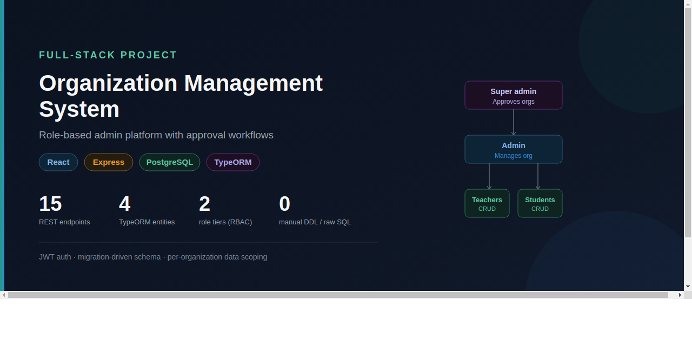
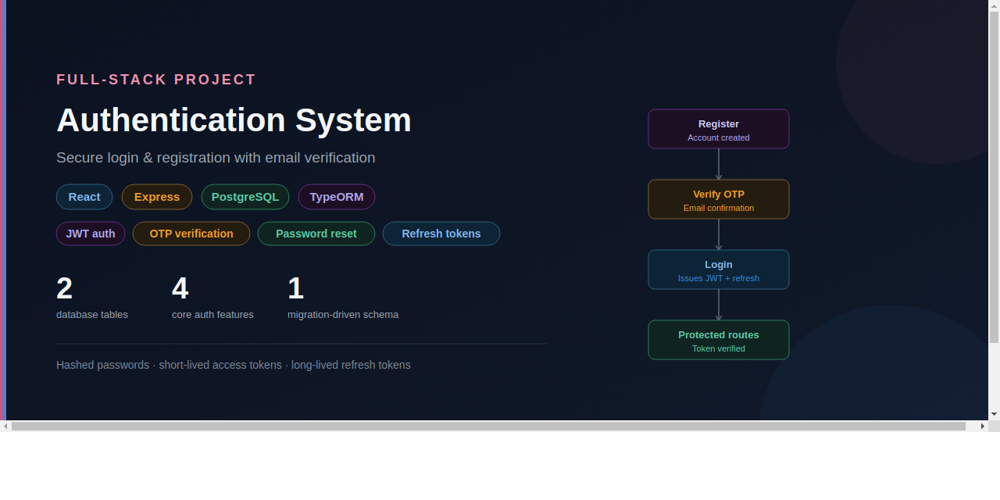
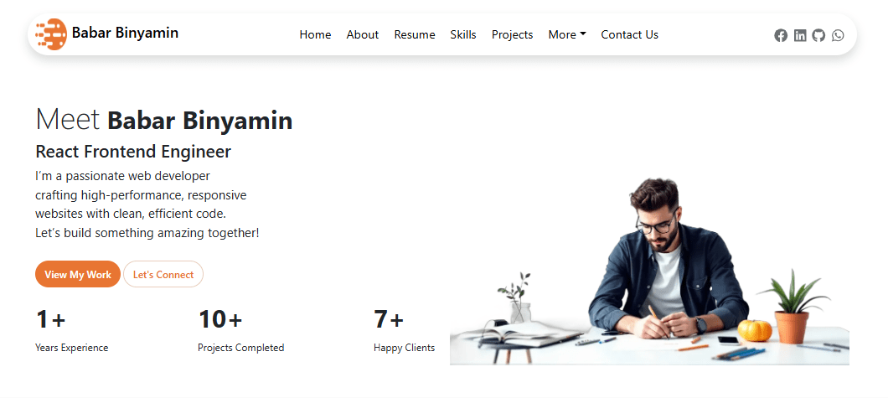

<h1 align="center">Hi 👋, I'm Babar Binyamin</h1>

<h3 align="center">Full Stack Developer</h3>

  

## 👨‍💻 About Me

I'm a **Full Stack Developer** with **1+ year of experience** building modern, scalable web applications using React.js, Next.js, Node.js, Express.js, PostgreSQL, and MongoDB.

- 💼 Full Stack Developer Intern at **Zigron Software Company**
- 🚀 Building secure, scalable web applications with clean architecture, REST APIs, JWT authentication, and database design
- 🌱 Currently learning **System Design, Docker, CI/CD, Microservices, and advanced PostgreSQL**
- 🎯 Building Secure REST APIs & Scalable Systems

## 🏆 Highlights

- 💼 **1+ year** of Full Stack Development experience
- 🚀 Built **5+ production-ready** web applications
- 🔐 Developed secure REST APIs with **JWT Authentication**
- 🗄️ Experienced with **PostgreSQL, MongoDB, and TypeORM**
- ⚡ Passionate about scalable backend architecture and clean code

## 🌐 Connect with Me

  

  

  

## 🛠️ Tech Stack

  

## 🚀 Featured Projects

<table>
<tr>
<td width="50%" valign="top">

### 🏢 Organization Management System

Multi-tenant management platform with JWT authentication, role-based access control, and PostgreSQL-backed data isolation.

  
  
  
  
  

<a href="YOUR_OMS_LIVE_DEMO">🌐 Live Demo</a> •
<a href="YOUR_OMS_REPOSITORY">📂 Repository</a>

</td>

<td width="50%" valign="top">

### 🔐 Authentication System

Secure authentication API featuring JWT authorization, request validation, and reusable Express middleware.

  
  
  
  

<a href="YOUR_AUTH_REPOSITORY">📂 Repository</a>

</td>
</tr>

<tr>
<td width="50%" valign="top">

### 🌿 EverleafCo

Modern e-commerce application with product browsing, shopping cart, responsive design, and smooth UI animations.

  
  
  
  
  

<a href="https://everleafco.netlify.app/">🌐 Live Demo</a> •
<a href="https://github.com/Babar-Developer-2001/everleafCo">📂 Repository</a>

</td>

<td width="50%" valign="top">

### 💼 Portfolio

Personal portfolio showcasing production-ready projects, responsive UI, and interactive Framer Motion animations.

  
  
  
  

<a href="https://babar-binyamin.netlify.app/">🌐 Live Demo</a> •
<a href="https://github.com/Babar-Developer-2001/babar-binyamin">📂 Repository</a>

</td>
</tr>
</table>

## 📊 GitHub Stats

<table align="center">
<tr>
<td>

</td>
<td>

</td>
</tr>
</table>

## 🔥 Contribution Streak

  

## 📈 Activity Graph

  

## 👀 Visitor Counter

  

## 🐍 Contribution Snake

  

